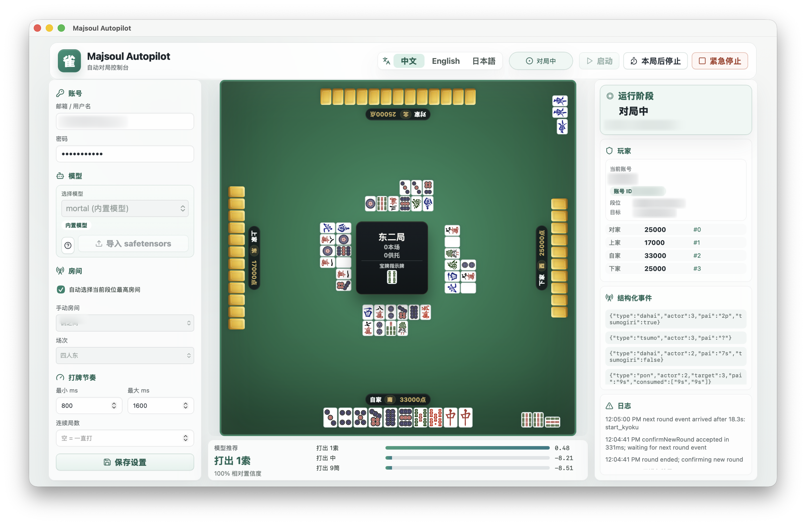

# majsoul-autopilot

[English](README.en.md)

一个基于 Mortal 模型和 Liqi 协议的纯 Rust 雀魂自动打牌工具。打包体积极小，零 Python 与浏览器依赖，开箱即用。

本项目同时提供桌面 GUI 和命令行程序。程序使用邮箱账号登录雀魂，通过 Liqi websocket 协议完成匹配、进局、重连和对局操作，并由 Mortal 模型决定打牌动作。



## 功能特性

- **极致轻量，开箱即用**：纯 Rust 构建，打包体积极小，无需安装 Python 环境或浏览器驱动，解压即用
- **纯协议自动化**：基于 Liqi 协议直接与服务端通信，不依赖浏览器、截图识别或坐标点击
- **动态版本自适应**：自动检测并提取官方最新客户端及资源版本，游戏更新无需发版
- **四人段位场匹配**：按账号段位自动选择目标房间（铜/银/金/玉/王座）
- **原生模型推理**：使用 Candle 进行 Mortal 原生推理
- **桌面 GUI 客户端**：提供现代化 Tauri 桌面控制台，配置、状态、日志、牌桌一目了然
- **断线自动重连**：支持已有对局断线重连与状态恢复
- **立直二段决策**：完整支持 Mortal 立直二段决策流程
- **操作保护机制**：包含 operation 过期保护与弃牌 ACK 校验
- **完善终局判定**：支持庄家和了止め、击飞即时判定及服务端终局容错处理

## 房间策略

程序会根据账号段位自动选择房间：

| 段位 | 目标房间 |
| --- | --- |
| 初心（未到雀士） | 铜之间四人东 |
| 雀士 | 银之间四人南 |
| 雀杰 | 金之间四人南 |
| 雀圣 | 玉之间四人南 |
| 魂天 | 王座之间四人南 |

当前不支持三人麻将入口。

## 下载

macOS Apple Silicon 预编译包可以在 GitHub Releases 下载：

[下载最新版本](https://github.com/happy-shine/majsoul-autopilot/releases/latest)

包内包含：

```text
majsoul-autopilot-macos-arm64/
  Majsoul Autopilot.dmg     # macOS 桌面图形界面安装包
  majsoul-autopilot-rs      # 命令行程序
  settings.example.json     # 配置示例
  INSTALL.zh-CN.txt         # 安装与使用说明
  models/
    mortal/
      model.safetensors     # Mortal safetensors 模型
      model_config.json     # 模型配置
```

## 快速开始

### 桌面 GUI 版
1. 打开 `Majsoul Autopilot.dmg` 并将 `Majsoul Autopilot.app` 拖入 `Applications` 目录。
2. 启动应用，在设置页填写账号密码即可开始。

### 命令行版
解压 `majsoul-autopilot-macos-arm64.zip` 后进入目录：

```bash
cd majsoul-autopilot-macos-arm64
cp settings.example.json settings.json
```

编辑 `settings.json`：

```json
{
  "model_path": "models/mortal",
  "autoplay_account": {
    "username": "your-email@example.com",
    "password": "your-password"
  }
}
```

检查模型文件：

```bash
./majsoul-autopilot-rs --settings settings.json check-model
```

检查登录状态与目标房间：

```bash
./majsoul-autopilot-rs --settings settings.json check-login
```

只运行一局：

```bash
./majsoul-autopilot-rs --settings settings.json run --max-games 1
```

持续运行：

```bash
./majsoul-autopilot-rs --settings settings.json run
```

使用 `Ctrl-C` 停止程序。

## 配置

`settings.json` 是唯一必需的运行时配置文件。

```json
{
  "model_path": "models/mortal",
  "autoplay_account": {
    "username": "",
    "password": ""
  }
}
```

字段说明：

| 字段 | 说明 |
| --- | --- |
| `model_path` | Mortal 模型目录，目录内需要 `model.safetensors` 和 `model_config.json` |
| `autoplay_account.username` | 雀魂邮箱账号 |
| `autoplay_account.password` | 雀魂密码 |

`settings.json` 包含账号信息，默认不会提交到 git。

## 命令

```bash
majsoul-autopilot-rs --settings settings.json check-model
majsoul-autopilot-rs --settings settings.json check-login
majsoul-autopilot-rs --settings settings.json run
majsoul-autopilot-rs --settings settings.json run --max-games 1
majsoul-autopilot-rs --settings settings.json replay-fixture path/to/fixture.json
```

## 从源码构建

安装 Rust 后执行：

```bash
cargo build --release -p majsoul-autopilot-rs
```

构建产物位于：

```text
target/release/majsoul-autopilot-rs
```

构建桌面 App：

```bash
npm --prefix apps/desktop install
npm --prefix apps/desktop run tauri -- build
```

从源码本地运行时，需要准备：

```text
settings.json
models/mortal/model.safetensors
models/mortal/model_config.json
```

模型权重和本地账号配置不会提交到仓库。

## 开发

运行测试：

```bash
cargo test --workspace -- --nocapture
```

运行 clippy：

```bash
cargo clippy --workspace --all-targets -- -D warnings
```

## 项目结构

```text
crates/
  autoplay/      自动打牌动作规划和 operation 保护
  cli/           命令行入口
  liqi/          protobuf 类型和 Liqi framing
  mjai/          Liqi 到 MJAI 的事件桥接
  mortal/        Mortal 推理和动作解码
  protocol/      lobby/game websocket 客户端
  riichi-core/   立直麻将状态和 observation 编码
apps/
  desktop/       Tauri 桌面 App
```

## 免责声明

本项目仅用于研究和实验。使用前请自行确认相关服务规则，并自行承担使用风险。

## 许可证

GPL-3.0-or-later。详见 [LICENSE.txt](LICENSE.txt)。
